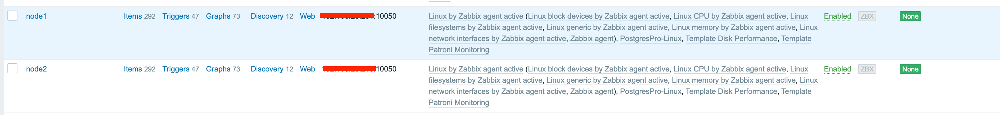
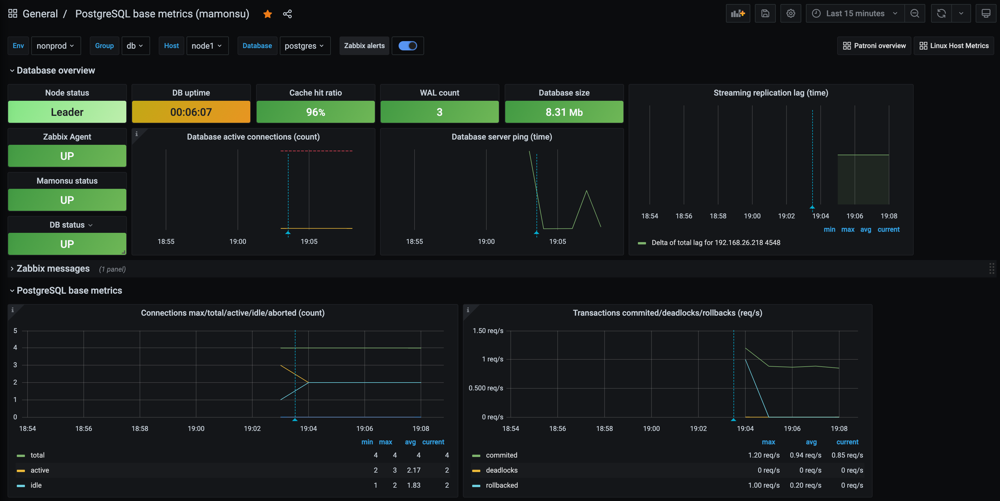
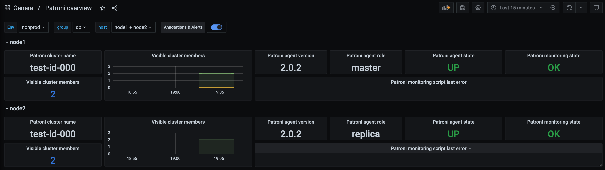
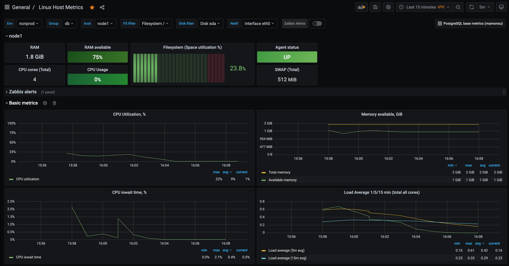

# Automation scripts

##  1. Prerequisites

In order to use the automation scripts, you should perform the initial configuration, which includes:

* Setting up ansible configuration file.
* Inventory setup.
* Setting up dependencies (community roles).
* Setting variable values.

### 1.1 Setting up ansible configuration file

Here is an example of ansible configuration file - [`ansible.cfg`](./ansible.cfg). You need to set the values of the following parameters:

* `ansible_user` and `remote_user` - the name of the user under whom the deployment process will be carried out;
* `ansible_ssh_private_key_file` - private ssh key for password free access to the configured nodes;
* `roles_path` - paths to the ansible roles, by default it's `~/.ansible/roles` - where the dependent roles will be installed, and `./roles` in the folder of the automation project was added for custom roles.

There is an example file directly in the repository, it's listing is below.

<pre>
[defaults]
ansible_user=my-ansible-user
remote_user=my-remote-ansible-user
ansible_ssh_private_key_file=~/.ssh/my-private-key
forks = 10
transport = ssh
callback_whitelist = profile_roles, timer
host_key_checking = False
stdout_callback = yaml
retry_files_enabled = False
deprecation_warnings=False

# Path to the roles
roles_path=~/.ansible/roles:./roles

[paramiko_connection]
record_host_keys=False

[diff]
always = True
context = 3

[ssh_connection]
ssh_args = -o ForwardAgent=yes -o ControlMaster=auto -o ControlPersist=60s
</pre>

Of course, the user who is deploying the roles must be present on the target hosts and have sudo privileges, the public ssh key of that user must also be present on the target hosts.

### 1.2 Inventory setup

You also need to create an inventory file in which you need to describe the target hosts and divide them into groups.
The basic idea of this automation approach is to divide hosts into groups based on their semantic value, which allows you to use group variables of the ansible. When you start a deploy, ansible finds the target host group where the deploy is taking place, finds the necessary group variables, and uses them.

<pre>
automation/
│
├── README.md
├── ansible.cfg
├── inventories
│   ├── nonprod
│   │   ├── group_vars
│   │   │   ├── all
│   │   │   │   ├── all.yml
│   │   │   │   └── zabbix_agent.yml
│   │   │   └── postgres
│   │   │       ├── main.yml
│   │   │       ├── mamonsu.yml
│   │   │       ├── patroni.yml
│   │   │       └── pgbackrest.yml
│   │   ├── inventory.yml
│   │   └── nonprod-static.yml
│   └── prod
│       ├── group_vars
│       │   ├── all
│       │   │   └── all.yml
│       │   └── postgres
│       └── prod-static.yml
</pre>

The structure of the catalog is given above.
The group_vars directory contains the subdirectories [`all`](inventories/nonprod/group_vars/all/) and [`postgres`](inventories/nonprod/group_vars/postgres), as well as the `inventory.yml` and `nonprod-static.yml` files.

The file `inventory.yml` lists **all the hosts** that we deploy to, in the file `nonprod-static.yml` these hosts are distributed into groups. The `postgres` host group includes two hosts `node1` and `node2` on which PostgreSQL 13, Patroni cluster, zabbix agents, pgBackRest and mamonsu should be deployed.
The `group_vars` folder has two subdirectories `all` and `postgres`. The `all` directory contains two files `all.yml` and `zabbix_agent.yml` which contain variables for roles and playbooks relevant to **all hosts**.

The `postgres` directory contains the files `main.yml`, `patroni.yml`, `pgbackrest.yml`, and `mamonsu.yml`. These files contain variables relevant to the corresponding playbooks. 
When we start the deploy process, the ansible looks at which host group we are applying the playbook to, searches the inventory for that host group, searches the group variables for the directory with the host group name, reads the variables from the `.yml` files from that directory and uses them in the playbook.

The example of [`inventory.yml`](inventories/nonprod/inventory.yml):

```yaml
all:
  hosts:
    node1:
      ansible_host: 192.168.0.100
    node2:
      ansible_host: 192.168.0.101
```

The example of [`nonprod-static.yml`](inventories/nonprod/nonprod-static.yml):

```yaml
postgres:
  hosts:
    node1:
    node2:

cluster-nonprod-01:
  hosts:
    node1:
    node2:
```

To make playbooks universal and be able to deploy them to other environments, simply create subfolders `qa`, `stage`, `prod` in the `inventories` folder and make them the same directory and file structure as in the nonprod folder, where you define variables relevant to the respective environments.

### 1.3 Setting up dependencies (community roles).

This automation uses roles written by the community. 

We have two kinds of playbooks:

* basic,
* adhoc.

Basic playbooks are needed to deploy binaries to target hosts. Ad-hoc playbooks are needed to deliver configuration files to the target hosts and to start the corresponding services.

In order to use basic playbooks, we will need to install the following dependencies.
These dependencies are described in the `requirements.yml` files. These dependencies must be installed before using the basic playbooks. 

This should be done with the following commands:

```shell
$ ansible-galaxy install -r playbooks/basic/<basic-playbook-name>/requirements.yml --force
```

<pre>
playbooks/basic
│
├── mamonsu
│   └── main.yml
├── patroni
│   └── main.yml
├── pgbackrest
│   ├── main.yml
│   └── requirements.yml
├── postgres
│   ├── main.yml
│   └── requirements.yml
└── zabbix-agent
    ├── deploy_one_script.yml
    ├── main.yml
    └── requirements.yml
</pre>

Looking at the directory structure given in the [`playbooks/basic`](playbooks/basic) directory, you need to install the dependencies for playbooks `pgbackrest`, `postgres`, `zabbix-agent`.

For ad-hoc playbooks used only for configuring dependencies in the form of external community roles are not used.

### 1.4 Setting variable values

Each service to be deployed has its own settings required for its operation. Most of the configuration files for services are template-based, and variables are described in the corresponding group variable files. To deploy roles and configuration files to the infrastructure, we must define the values of the infrastructure-specific variables.

A list of variables that must be defined:

#### 1.4.1 Common variables

File [`all.yml`](inventories/nonprod/group_vars/all/all.yml), subnet and encoding used:

* `INTERNAL_CIDR: "192.168.26.0/24"`
* `encoding: "en_US.UTF-8"`

#### 1.4.2 Zabbix Agent

File [`zabbix_agent.yml`](inventories/nonprod/group_vars/all/zabbix_agent.yml):

* `zabbix_agent_serveractive: "my.zabbix.server.fqdn.or.ip"` - Zabbix server address
* `zabbix_agent_hostmetadata: "env=environment;groups=group_one,groups_two"` - actual metadata for the host

#### 1.4.3 PostgreSQL

File [`main.yml`](inventories/nonprod/group_vars/postgres/main.yml):

* `postgresql_data_dir` - PG database folder.
* `postgresql_bin_path` - path to the PG binary files.
* `postgresql_hba_entries` - pg_hba.conf related settings.
* `postgresql_locales` - database locale config.

#### 1.4.4 Patroni

File [`patroni.yml`](inventories/nonprod/group_vars/postgres/patroni.yml):

* `patroni_cluster_name: "my-cluster-name"` - the cluster name definition.
* `used_dcs_system: etcd` - available values: `etcd`, `consul`, `raft`.
* `CIDR` - network definition.
* `patroni_consul_token: MY-CONSUL-TOKEN` - for the consul we need place token here.

#### 1.4.5 pgBackRest

File [`pgbackrest.yml`](inventories/nonprod/group_vars/postgres/pgbackrest.yml):

* `pgbackrest_repo_path: "/path/to/the/backup/repository"` - path to the backup repository.
* `pgbackrest_stanza_name: "my-stanza"` - name of the pgBackRest repo.

#### 1.4.6 Mamonsu

File [`mamonsu.yml`](inventories/nonprod/group_vars/postgres/mamonsu.yml):

* `superuser_name` - superuser name
* `superuser_password` - superuser password for the mamonsu bootstrap.

Some variables **reference other variables**, many of them defined in the main.yml file, so be careful when changing them.

## 2. Deployment process

If we have set all the variables correctly, we have an Internet connection on the hosts, then the deployment process looks very simple. There is a scripts folder in the repository for easy deployment: 

<pre>
scripts/
│
├── ad-hoc
│   ├── ansible_config.sh
│   ├── mamonsu-nonprod.sh
│   ├── patroni-nonprod.sh
│   ├── pgbackrest-nonprod.sh
│   └── zabbix-agent-nonprod.sh
├── ansible_config.sh
├── mamonsu-nonprod.sh
├── patroni-nonprod.sh
├── pgbackrest-nonprod.sh
├── postgres-nonprod.sh
└── zabbix-agent-nonprod.sh
</pre>

The scripts need to be run in a certain sequence:

* zabbix-agent-nonprod.sh
* postgres-nonprod.sh
* patroni-nonprod.sh
* pgbackrest-nonprod.sh
* mamonsu-nonprod.sh

Each script can additionally accept standard ansible parameters such as `--check`, `--tags`, `--limit`, etc.

An example of running scripts (deploy Zabbix Agent only to the node1 and PostgreSQL only to the node2):

```shell
$ ./zabbix-agent-nonprod.sh -l node2
$ ./postgres-nonprod.sh -l node1
```

To create a template VM with all bunch of software we should run all these scripts in a certain sequence. All services will be stopped on this VM, it's defined in current configuration. 
If we deploy all software without templating - no changes are needed. 

If you see some errors during the Zabbix Agent deployment, it is a normal situation, it is related to the use of the community role.

As an example we can execute all scripts:

```shell
# ./zabbix-agent-nonprod.sh -l node1,node2 && ./postgres-nonprod.sh -l node1,node2 && ./patroni-nonprod.sh -l node1,node2 && ./pgbackrest-nonprod.sh -l node1,node2 && ./mamonsu-nonprod.sh -l node1,node2
```

## 3. Configuration process

The next part of the deploymet is the configuration and starting services.

We should apply all scripts located in the ad-hoc folder in a certain sequence:

* zabbix-agent-nonprod.sh
* postgres-nonprod.sh
* patroni-nonprod.sh
* pgbackrest-nonprod.sh
* mamonsu-nonprod.sh

These scripts will only deliver configuration files to the target hosts and run the necessary services. In general, these are the same scripts described in the previous section.

As an example we can execute all scripts:

```shell
# ./zabbix-agent-nonprod.sh -l node1,node2 && ./patroni-nonprod.sh -l node1,node2 && ./pgbackrest-nonprod.sh -l node1,node2 && ./mamonsu-nonprod.sh -l node1,node2
```

## 4. Expected result

The result of ansible should be as follows - it should be configured and running:

* Zabbix Agent on each cluster node;
* Patroni and Consul based DBMS cluster;
* pgBackRest is installed, the backup repository is initialized and the schedule for backups is set;
* Installed monitoring agent Mamonsu;
* Hosts should appear under the hosts section of the Zabbix Server, they should be added to the appropriate groups and templates should be assigned to them;
* These hosts should also appear in the visualization system in Grafana.

See the screenshots:

* Zabbix: hosts



* Grafana: PostgreSQL



* Grafana: Patroni



* Grafana: Linux Host

